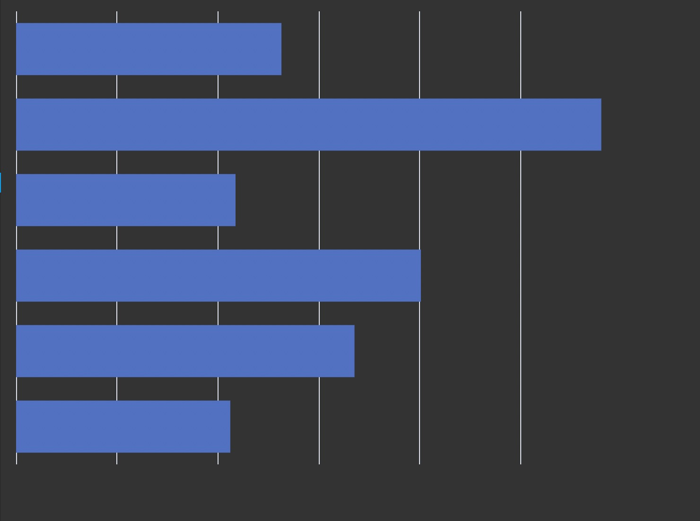

# Echarts EL

[](https://github.com/gsmlg-dev/echarts-el/actions/workflows/nodejs-lit-validate-and-release.yml)

[](https://gsmlg-dev.github.io/echarts-el)

# Feature

- Auto fit parent element, so your do not need to resize it.
- Rerender if data changed.

# Install

```bash
npm install echarts-el
```

# Use Case

This element will fit parent element and auto resize when parent element size change.

```html
<echarts-el>
    {
    tooltip: {
      show: true,
    },
    grid: {
      x: 0,
      y: 0,
      x2: 0,
      y2: 0,
    },
    xAxis: [
      {
        min: 0,
        scale: true,
        type: 'value',
      },
    ],
    yAxis: [
      {
        type: 'category',
        show: false,
        data: ['2021-01', '2021-02', '2021-03', '2021-04', '2021-05', '2021-06'],
      },
    ],
    series: [
      {
        type: 'bar',
        data: [2123, 3354, 4012, 2175, 5800, 2630],
      },
    ],
  }
</echarts-el>
```

Render chart:


# Attrinutes

- `loading`: Show Loading chart
- `renderer`: Use echarts `svg` or `canvas` renderer
- `textContent`: EChart options, JSON string.

# Properties

- `resetChart`: Method to reset chart render
- `chart`: Echart instance
- `options`: Chart render options, readonly.

# TODO

- Add esm bundle, support es2017 import on the fly.
- Add map register element.
